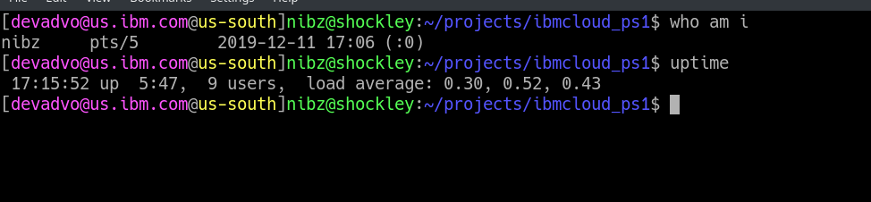

Bash prompt for IBM Cloud
-------------------------


Adds IBM Cloud information to your prompt/PS1.





Quickstart
----------


1. Download the repo

2. Source `ibmcloud_prompt.sh` in your `.bashrc` or similar

3. Set up a `PROMPT_COMMAND` that calls `__ibmcloud_ps1` on its way to set `PS1`


Configuration Environment Variables
-----------------------------------


* `IBMCLOUD_PS1_COLOR_NO`: set to any value to disable color in the prompt


Example Installation
--------------------


Add this to `.bashrc`


```bash
# Just an example of where this goes
set_prompt() {
    PS1="[$(__ibmcloud_ps1)]"
    PS1+="\[${bldgrn}\]\u@\h\[${txtrst}\]:\[${bldblu}\]\w\[${txtrst}\]$ "
}

PROMPT_COMMAND=set_prompt
```
